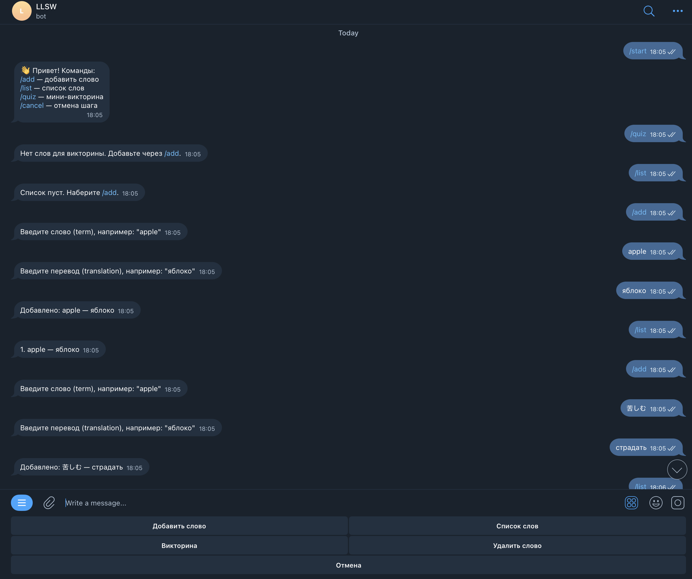
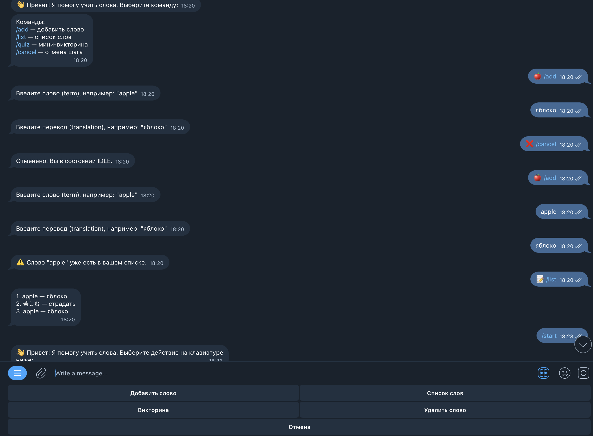

LLSWwbot

LLSWwbot(Let's Learn Some Words wbot) — это учебный проект на Node.js, предназначенный для работы с Telegram API.
Бот помогает пользователям тренировать словарный запас: получать слова, проверять переводы и отслеживать результаты.

Основные возможности
Подключение к Telegram через node-telegram-bot-api
Работа с командами и сообщениями пользователей
Хранение и обработка данных о словах
Настройка окружения через .env
Проверка качества кода с помощью ESLint

Технологии
Node.js
JavaScript (ES Modules)
ESLint
dotenv
Telegram Bot API

Команда	Что делает
/start	Приветствие. Показывает, что бот запущен и объясняет, что он умеет.
/help	Выводит список всех команд с кратким описанием.
/newword	Показывает новое слово для запоминания.
/check	Проверяет знание слов — бот задаёт вопрос, нужно ввести перевод.
/stats	Показывает статистику — сколько слов выучено, сколько ошибок.
/reset	Сбрасывает прогресс (начать заново).
/stop	Останавливает текущую тренировку или сеанс.

Инструкция по запуску:
1. Написать в консоль npm start
2. Зайти в телеграм
3. Найти бота по тегу @LLSWwbot
4. Веселиться и наслаждаться

